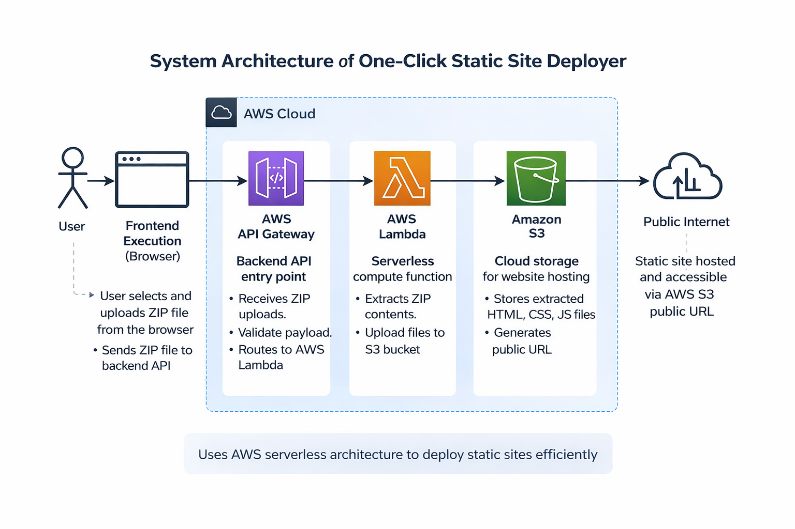
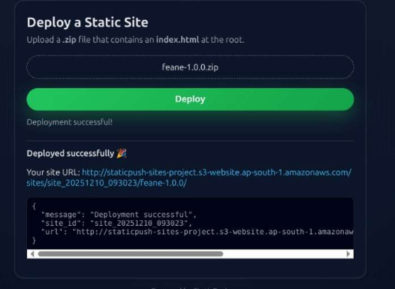
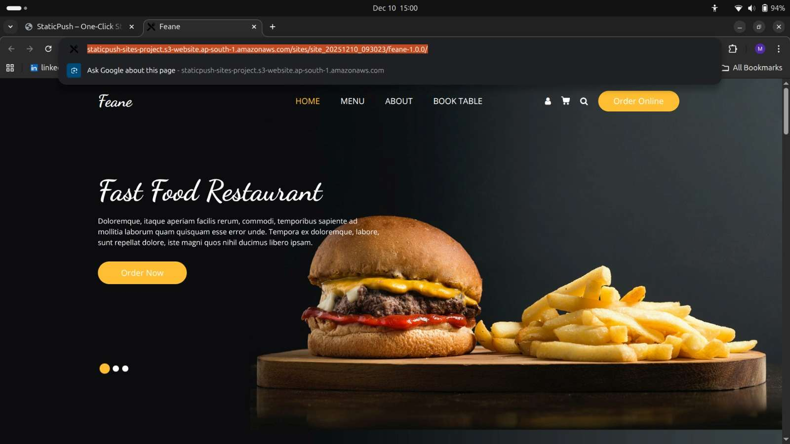

# Minor Project – One-Click Static Site Deployer (StaticPush)

## 📌 Overview
StaticPush is a serverless web-based tool that allows users to deploy a static website by uploading a ZIP file containing HTML, CSS, and JavaScript files. The system automatically extracts the ZIP file, uploads its contents to cloud storage, and generates a public URL for access.

This project was developed as part of a Minor Project to understand serverless architecture and cloud-based deployment using AWS services.

---

## 🎯 Objectives
- Simplify static website deployment
- Eliminate the need for manual cloud configuration
- Learn serverless computing concepts
- Understand real-world cloud deployment workflows

---

## 🛠️ Tech Stack
- **Frontend:** HTML, CSS, JavaScript 
- **Backend:** AWS Lambda (Python) 
- **Cloud Services:** Amazon API Gateway, Amazon S3 

---

## ⚙️ How the System Works
1. User uploads a ZIP file containing a static website
2. Frontend sends the ZIP file to API Gateway
3. AWS Lambda function receives the request
4. ZIP file is extracted in memory
5. Files are uploaded to an S3 bucket
6. A public website URL is generated and returned

---

## 🧱 System Architecture

---

## 📸 Screenshots

### Project Interface

### Successful Deployment Output

### Live Running Website

---

## 🚀 How to Run (Frontend Only)
1. Clone the repository
2. Open `index.html` in a web browser
3. Replace the API endpoint with your own API Gateway URL
4. Upload a ZIP file containing `index.html`

---

## ⚠️ Important Note
The AWS resources (Lambda function, API Gateway, and S3 bucket) used during development were **temporary** and have been **deleted after project completion** to avoid unnecessary cloud costs.

To make the project fully functional again:
- Create your own AWS Lambda function
- Configure API Gateway
- Create an S3 bucket
- Replace the placeholder API URL in the frontend code

---

## 📚 Learning Outcomes
- Understanding of serverless architecture
- Practical experience with AWS Lambda and S3
- API integration with frontend applications
- Secure handling of file uploads

---

## 🔮 Future Enhancements
- Custom domain support
- Authentication and access control
- Deployment history dashboard
- Support for dynamic websites

---

## 👨‍🎓 Academic Declaration
This project was developed as part of a Minor Project during undergraduate studies and is intended for learning and academic demonstration purposes.

